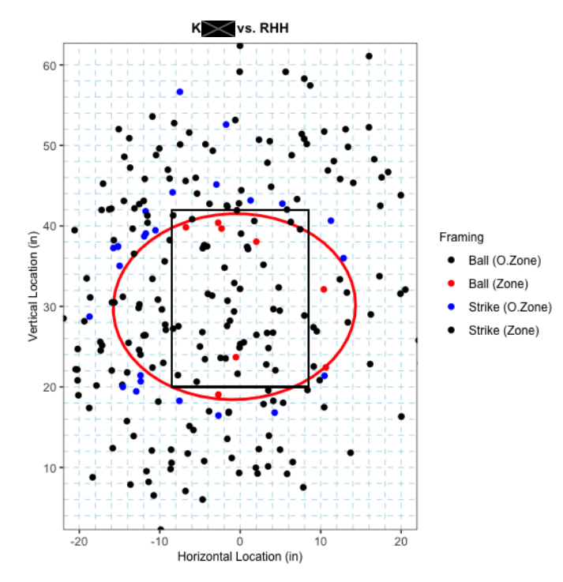

# pitch-framing

"Catcher framing is the art of a catcher receiving a pitch in a way that makes it more likely for an umpire to call it a strike -- whether that's turning a borderline ball into a strike, or not losing a strike to a ball due to poor framing. The effects of a single pitch can be huge; in 2019, hitters had an .858 OPS after a 1-0 count, but just a .631 OPS after an 0-1 count." [[source]](https://www.mlb.com/glossary/statcast/catcher-framing)

I created a visualization so catchers can see how they perform when pitches are in different locations. In this example, we can see that this catcher tends to miss strike calls in the top of the zone.

