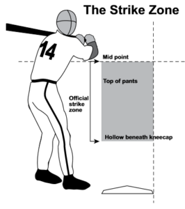

# swing-efficiency

The strike zone in NCAA Division I Baseball is defined as: "The area over home plate from the bottom of the kneecaps to the midpoint between the top of the shoulders and the top of the uniform pants. The strike zone shall be determined from the batter’s stance as the batter is prepared to swing at a pitched ball" [[source]](https://baseballrulesacademy.com/official-rule/ncaa/ncaa-2-75-strike-zone/)

&nbsp  

This strike zone is objectively written but subjectively enforced. To help our team understand what the "real" strike zone is, I created a strike zone of pitch locations of greater than 50% called strike probability using a generalized additive model.

